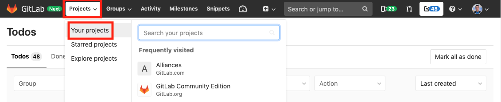
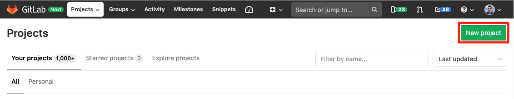
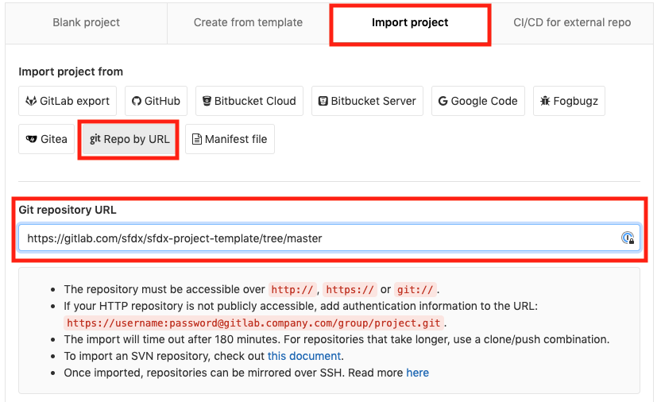
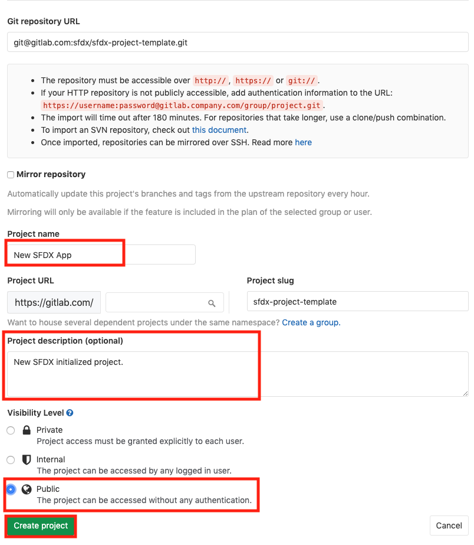

# SFDX-Project-Template

Context and details on project templates for Salesforce

# Importing Project Templates

To use this project template for a new [GitLab Project](https://docs.gitlab.com/ee/user/project/) follow the steps below: 

### Step 1

Login to [Gitlab.com](https://gitlab.com/users/sign_in) and navigate to the [projects tab](https://gitlab.com/dashboard/projects) at the top. 

### Step 2

Click on 'Projects' and then 'Your Projects' in the top navigation drop down pane. 

 

Now click the [**New Project**](https://gitlab.com/projects/new) green button to create a new project. 

### Step 3 

Navigate to **Import Project** at the top of the page. Then click the **git Repo by URL** button. 

Enter in [this project's](https://gitlab.com/sfdx/sfdx-project-template/tree/master) git URL : [https://gitlab.com/sfdx/sfdx-project-template.git](https://gitlab.com/sfdx/sfdx-project-template.git) in the `Git repository URL` form field. 

### Step 4

Give your project a name and optionally a description to get started. Finally after confirming your **Visibility Level** for your new project, click the **Create Project** green button to initiate. 

After completing the steps above, you'll have a new project initialized under your GitLab account.

# Instructions 

Place holder for instructions on what/if anything needs to be changed/populated or files need to be edited for new applications after initializing a new project with this template.