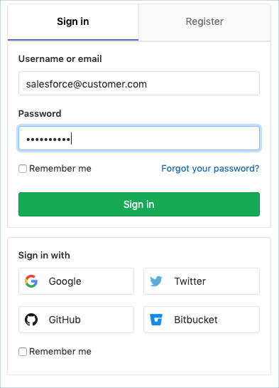

# Salesforce DX Project Template for GitLab Pipelines

This guide helps Salesforce developers get started with GitLab and Salesforce Development quickly including details on development models, setting up CI/CD with GitLab pipelines, and how to deploy your final changes to production.

# Part 1: Importing Project Templates

To use this project template for a new [GitLab Project](https://docs.gitlab.com/ee/user/project/) follow the steps below:

### Step 1

Log in to [GitLab.com](https://gitlab.com/users/sign_in). Need an account? You can [sign up](https://gitlab.com/users/sign_in) for a free GitLab account or [log in with Salesforce](https://gitlab.com/users/auth/salesforce).



### Step 2

Click on **Projects** and then **Your Projects** in the top navigation drop down pane.


Now click the [**New Project**](https://gitlab.com/projects/new) green button to create a new project.


### Step 3

Click **Import Project** tab at the top of the page, then click the **git Repo by URL** button.

Enter [this project's](https://gitlab.com/sfdx/sfdx-project-template) git URL: [https://gitlab.com/sfdx/sfdx-project-template.git](https://gitlab.com/sfdx/sfdx-project-template.git) in the `Git repository URL` form field.


### Step 4

Give your project a name and optionally a description to get started. Finally, after confirming your **Visibility Level** for your new project, click the **Create Project** green button to initiate.


After completing the steps above, you'll have a new project initialized under your GitLab account.

## Part 2: Choosing a Development Model

There are two types of developer processes or models at Salesforce. These models are explained below. Each model offers pros and cons and is fully supported.

### Package Development Model

The package development model allows you to create self-contained applications or libraries that are deployed to your org as a single package. These packages are typically developed against source-tracked orgs called scratch orgs. This development model is geared toward a more modern type of software development process that uses org source tracking, source control, and continuous integration and deployment.

If you are starting a new project, we recommend that you consider the package development model. For details about the model, see the [Package Development Model](https://trailhead.salesforce.com/en/content/learn/modules/sfdx_dev_model) Trailhead module.

When working with source-tracked orgs, use the commands `SFDX: Push Source to Org` (VS Code) or `sfdx force:source:push` (Salesforce CLI) and `SFDX: Pull Source from Org` (VS Code) or `sfdx force:source:pull` (Salesforce CLI). Do not use the `Retrieve` and `Deploy` commands with scratch orgs.

### Org Development Model

The org development model allows you to connect directly to a non-source-tracked org (sandbox, Developer Edition (DE) org, Trailhead Playground, or even a production org) to retrieve and deploy code directly. This model is similar to the type of development you have done in the past using tools such as Force.com IDE or MavensMate.

For details about the model, see the [Org Development Model](https://trailhead.salesforce.com/content/learn/modules/org-development-model) Trailhead module.

If you are developing against non-source-tracked orgs, use the command `SFDX: Create Project with Manifest` (VS Code) or `sfdx force:project:create --manifest` (Salesforce CLI) to create your project. If you used another command, you might want to start over with this command to create a Salesforce DX project.

When working with non-source-tracked orgs, use the commands `SFDX: Deploy Source to Org` (VS Code) or `sfdx force:source:deploy` (Salesforce CLI) and `SFDX: Retrieve Source from Org` (VS Code) or `sfdx force:source:retrieve` (Salesforce CLI). The `Push` and `Pull` commands work only on orgs with source tracking (scratch orgs).

This Project Template uses the Package Development Model

## The `sfdx-project.json` File

The `sfdx-project.json` file contains useful configuration information for your project. See [Salesforce DX Project Configuration](https://developer.salesforce.com/docs/atlas.en-us.sfdx_dev.meta/sfdx_dev/sfdx_dev_ws_config.htm) in the _Salesforce DX Developer Guide_ for details about this file.

The most important parts of this file for getting started are the `sfdcLoginUrl` and `packageDirectories` properties.

The `sfdcLoginUrl` specifies the default login URL to use when authorizing an org.

The `packageDirectories` filepath tells VS Code and Salesforce CLI where the metadata files for your project are stored. You need at least one package directory set in your file. The default setting is shown below. If you set the value of the `packageDirectories` property called `path` to `force-app`, by default your metadata goes in the `force-app` directory. If you want to change that directory to something like `src`, simply change the `path` value and make sure the directory you’re pointing to exists.

```json
"packageDirectories" : [
    {
      "path": "force-app",
      "default": true
    }
]
```

## Part 3: Input Gitlab CI/CD Pipeline Environment Variables

TO DO @doug -- Which environment variables are needed where to get the values, which ones have sensative information, which env. variables need to be protected and default value for those variables.

## Part 4: Develop your App

TO DO : @Doug -- Disclaimer that this has a sample 'hello world' app already pre-installed that can be easily removed/updated.

Overview on what needs to be done if a developer wanted to develop their own app.

## Part 5: Deploying to Production

Simply commit a change to your repository and see the GitLab CI/CD pipeline kick off!
